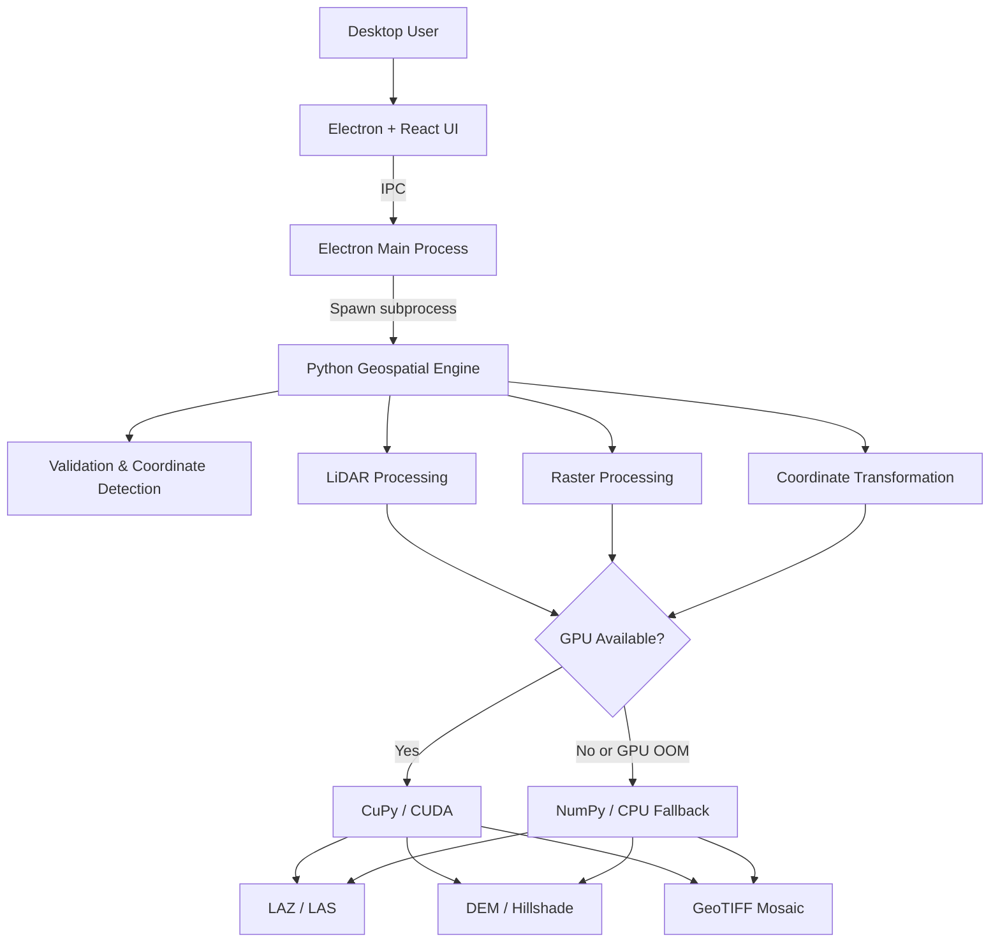

# Project A — GPU-Accelerated Geospatial Processing for Mining

> A production-oriented desktop application for large-scale LiDAR, raster, and coordinate-processing workflows, combining a modern Electron/React interface with a custom Python geospatial engine accelerated by NVIDIA CUDA.


---

## Overview

**Project A** is a desktop geospatial processing application designed to automate computationally intensive mining workflows involving **LiDAR point clouds**, **orthomosaics**, **digital elevation models**, and **local-to-UTM coordinate transformations**.

The project was created to replace a slower, license-dependent, black-box processing workflow with a **custom geospatial engine written in Python**, while providing operators with a guided desktop interface that does not require direct interaction with scripts or command-line tools.

The application separates the user interface from the processing engine:

* **Electron + React** provide the desktop experience and workflow orchestration.
* **Python** handles geospatial processing and file I/O.
* **CuPy / CUDA** accelerate high-volume numerical operations when an NVIDIA GPU is available.
* **NumPy CPU fallbacks** allow the same workflows to continue on systems without sufficient GPU resources.

The original production environment and client-specific configuration have been intentionally anonymized in this public showcase.

---

## Key Results

| Challenge                          | Result                                                                                   |
| ---------------------------------- | ---------------------------------------------------------------------------------------- |
| Large-scale LiDAR integration      | Production-validated processing of **500M+ point datasets**                              |
| End-to-end LiDAR workflow          | **7 min 51 sec** validated production run on RTX 5090                                    |
| Orthomosaic processing             | Reduced a representative workflow from **18 min to ~10 min**                             |
| Raster memory usage                | Reduced peak RAM from approximately **10 GB to <500 MB** using tiled processing          |
| Polygon point-in-polygon filtering | Reduced **11M-point filtering from ~55 sec to <1 sec**                                   |
| Coordinate transformation          | Approximately **2 sec for 11M LiDAR points** using GPU acceleration                      |
| Hardware resilience                | Automatic **GPU → CPU fallback** for memory-constrained environments                     |
| Deployment                         | Packaged as a Windows desktop application with guided workflows and live processing logs |

> Performance depends on dataset size, storage speed, requested output resolution, GPU model, and available RAM/VRAM.

---

## The Problem

Large mining geospatial datasets often combine information generated at different times, resolutions, coordinate systems, and spatial extents.

Typical operational challenges include:

* Integrating high-density LiDAR sectors into a lower-density global point cloud.
* Removing noisy overlap areas before merging datasets.
* Generating DEM and hillshade products from hundreds of millions of points.
* Combining large high-resolution orthomosaics without exhausting system memory.
* Transforming LiDAR and raster data between engineering coordinate systems and projected coordinates.
* Providing these capabilities to operational users without requiring them to manually run GIS scripts.

Project A addresses these problems through a single guided desktop application backed by a specialized geospatial processing engine.

---

## Core Workflows

### 1. LiDAR Integration

The LiDAR workflow merges multiple high-density survey sectors with a lower-density global point cloud.

The processing pipeline:

1. Loads the global point cloud.
2. Detects or applies operational zones.
3. Generates real data-coverage polygons.
4. Removes noisy sector boundaries using configurable buffers.
5. Removes overlapping global points.
6. Integrates the cleaned high-density sectors.
7. Generates elevation products.
8. Exports the final point cloud, DEM, hillshade, and detailed processing log.


#### Why this workflow is technically interesting

Instead of applying expensive geometric point-in-polygon operations directly to every point, the engine can rasterize the polygon and perform indexed lookups over millions of points.

For very large elevation grids, DEM generation switches automatically to a **tiled processing strategy backed by disk memory mapping**, avoiding the need to keep the complete grid in RAM.

The application also includes automatic CPU fallbacks when a GPU operation cannot fit in available VRAM.

---

### 2. RGB Orthomosaic Integration

The RGB workflow combines multiple high-resolution sector orthomosaics over a global base raster.

The engine processes the final mosaic **tile by tile**, instead of loading the complete output into memory.

Key characteristics include:

* 4096 × 4096 tiled processing.
* GPU-accelerated alpha compositing.
* Automatic BigTIFF support for large outputs.
* White/black fill detection for raster borders.
* Optional polygon-based sector overrides.
* Final polygon crop.
* Low and predictable RAM consumption.

In a representative production comparison, the tiled implementation reduced peak RAM usage from roughly **10 GB to under 500 MB**, while reducing processing time from **18 minutes to approximately 10 minutes**.


---

### 3. Coordinate Transformation

Project A includes batch coordinate transformation for:

* **LAZ / LAS point clouds**
* **GeoTIFF raster datasets**

The implementation uses a configurable **2D Helmert similarity transformation** based on translation, scale, and rotation.

For LiDAR datasets, coordinates are transformed in chunks to prevent GPU memory saturation.

For raster datasets, the application updates the spatial transform and georeferencing metadata without unnecessarily processing every pixel when the transformation model allows it.

Client-specific transformation parameters are intentionally excluded from this public repository.

---

## Interactive Pre-Processing

One of the most important features of the application is an interactive pre-processing stage that allows operators to review sectors before starting a long processing run.

The editor can display:

* Sampled LiDAR points using multiple Levels of Detail.
* Point-cloud coverage polygons.
* Operational zone polygons.
* Positive and negative processing buffers.
* Editable polygon vertices.
* Per-sector overrides.
* Real-time recalculation of buffer geometry.

This provides a visual quality-control step before hundreds of millions of points are processed.

---

## Application Experience

The desktop interface was designed as a **step-by-step wizard** rather than a large technical form.

Each workflow guides the user through only the decisions required at that stage.

```text
Input data
    ↓
Validation
    ↓
Sector / zone review
    ↓
Processing configuration
    ↓
Output selection
    ↓
Execution + live logs
```

The application also includes:

* Automatic input compatibility validation.
* Coordinate-system detection.
* Live process logs.
* Progress reporting.
* Elapsed-time tracking.
* Process cancellation.
* Protection against accidental double execution.
* UI locking while a process is running.
* GPU/CPU startup detection.

---

## Architecture



The UI and processing engine run as **separate processes**.

This architecture was selected because large GIS operations can consume significant RAM and VRAM. Isolating the Python engine allows memory to be released after each operation and prevents an engine failure from taking down the desktop interface.

---

## Technology Stack

### Desktop & Frontend

* Electron
* React
* Vite
* Tailwind CSS
* Node.js IPC
* HTML5 Canvas
* SVG overlays

### Geospatial Engine

* Python 3.11
* NumPy
* CuPy / CUDA
* Rasterio
* GDAL / PROJ
* LASpy / LAZRS
* Shapely
* SciPy
* PyProj
* Pillow
* psutil

### Geospatial Formats

* LAZ / LAS
* GeoTIFF / BigTIFF
* ESRI ASCII Grid
* DXF

---

## Engineering Highlights

### GPU acceleration with graceful CPU fallback

GPU acceleration is used selectively for operations that benefit most from parallel computation.

When a GPU is unavailable or a CUDA allocation fails, the engine can automatically continue using a CPU implementation.

This allows the same processing pipeline to run across very different hardware profiles.

---

### Memory-aware processing

Large geospatial workloads require controlling both RAM and VRAM.

Some of the strategies implemented include:

* Chunked coordinate transformation.
* Tile-based DEM generation.
* Tile-based raster mosaicking.
* Disk-backed memory maps for very large grids.
* Adaptive handling of low-memory systems.
* Explicit GPU memory release between tiles.
* Memory-efficient point-cloud subsampling.

A point-cloud export optimization replaced a high-memory uniqueness operation with integer grid keys and sorting, reducing a documented temporary memory peak from approximately **8.8 GiB to 2.2 GiB**.

---

### High-performance spatial filtering

A traditional geometric containment test was too expensive for multi-million-point datasets.

The optimized approach:

```text
Polygon
   ↓
Rasterized occupancy grid
   ↓
GPU/CPU indexed lookup
   ↓
Point mask
```

A representative **11 million point** filtering operation decreased from approximately **55 seconds to under one second**.

---

### Tiled GPU raster processing

Large mosaics are processed incrementally:

```text
Global raster
     +
High-resolution sectors
     ↓
4096 × 4096 processing tiles
     ↓
Alpha compositing
     ↓
Write tile directly to disk
     ↓
Final GeoTIFF / BigTIFF
```

This avoids keeping the complete raster in memory and makes very large outputs practical on standard workstations.

---

### Precision-aware coordinate processing

Large projected coordinates can lose meaningful spatial precision when handled carelessly with lower-precision floating-point types.

The engine therefore preserves high precision where absolute coordinates require it, while using relative coordinate offsets and lower-precision arrays only in GPU operations where the numerical error remains below the required spatial tolerance.

---

## Outputs

Depending on the selected workflow, Project A can produce:

* Integrated LAZ / LAS point clouds.
* Float32 Digital Elevation Models.
* GeoTIFF DEM products.
* ESRI ASCII Grid DEM products.
* Multidirectional hillshade GeoTIFFs.
* Unified RGB orthomosaics.
* Detailed processing reports with per-stage timing and sector statistics.

---

## Validation & Testing

The project includes integration test runners for the LiDAR and RGB processing pipelines, including variants designed for lower-performance workstations.

Testing covers combinations of:

* Local and projected coordinate datasets.
* Zone-enabled and zone-disabled processing.
* LiDAR workflows.
* RGB workflows.
* Export configurations.
* Different hardware profiles.

The application has also been exercised on NVIDIA GPUs ranging from memory-constrained workstation cards to high-end RTX hardware, with automatic fallback paths designed for systems that cannot keep the complete operation in VRAM.

---

## Performance Snapshot

| Workflow / Optimization                  |                  Result |
| ---------------------------------------- | ----------------------: |
| Large LiDAR production workflow          |            **7:51 min** |
| LiDAR dataset scale                      |        **500M+ points** |
| 11M-point coordinate transformation      |       **~2 sec on GPU** |
| 11M-point polygon filtering              |    **~55 sec → <1 sec** |
| Representative RGB mosaic                |    **18 min → ~10 min** |
| RGB peak RAM                             |    **~10 GB → <500 MB** |
| Point-cloud subsampling temporary memory | **~8.8 GiB → ~2.2 GiB** |

The latest internal optimization work achieved additional improvements on high-end GPU hardware, but this showcase prioritizes production-validated figures.

---

## My Role

I designed and developed the project across the complete application stack, including:

* Geospatial workflow architecture.
* LiDAR point-cloud processing.
* Raster and orthomosaic processing.
* GPU acceleration and CPU fallback strategies.
* Coordinate transformation workflows.
* Spatial validation and automatic coordinate detection.
* Electron ↔ Python process communication.
* React desktop UI and workflow design.
* Interactive geospatial preview tools.
* Performance profiling and memory optimization.
* Packaging, testing, and deployment workflows.

This project combines my background in **geomatics, surveying, GIS, coordinate systems, and mining operations** with software engineering and GPU computing.

---

## Repository Scope

This repository is a **public portfolio showcase**.

The production source code, calibrated transformation parameters, operational polygons, internal datasets, and client-specific configuration are intentionally not included.

The goal of this repository is to document:

* The problem that was solved.
* The architecture of the solution.
* The technical challenges involved.
* The processing workflows.
* The performance improvements achieved.
* The final application experience.

---

## Gallery soon

---

## Status

**Production-oriented / validated on real large-scale geospatial datasets.**

This repository contains documentation and visual material only. The production implementation remains private.

---

## Author

**Tito Ruiz**
Geomatics Engineer · Geospatial Developer · Mining Technology

Focused on geospatial automation, coordinate systems, GIS, LiDAR, GPU computing, and software development for mining applications.
